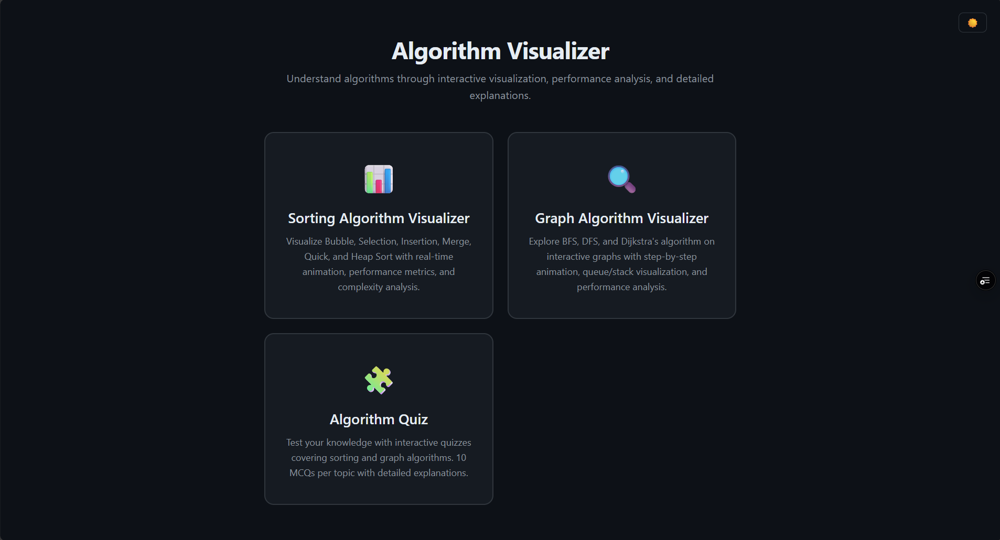
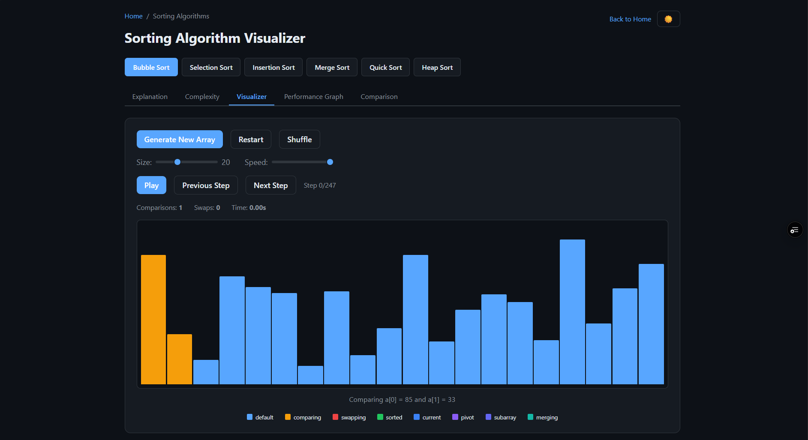
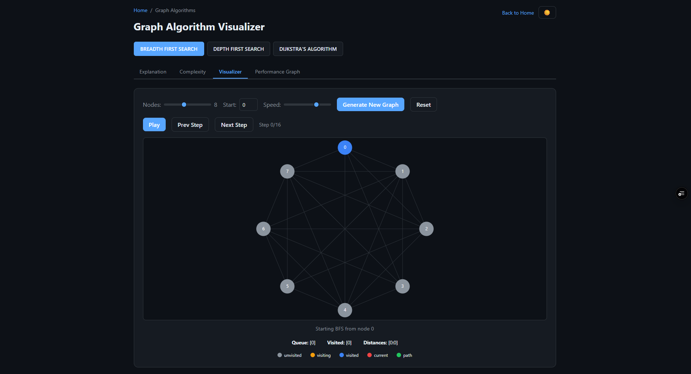
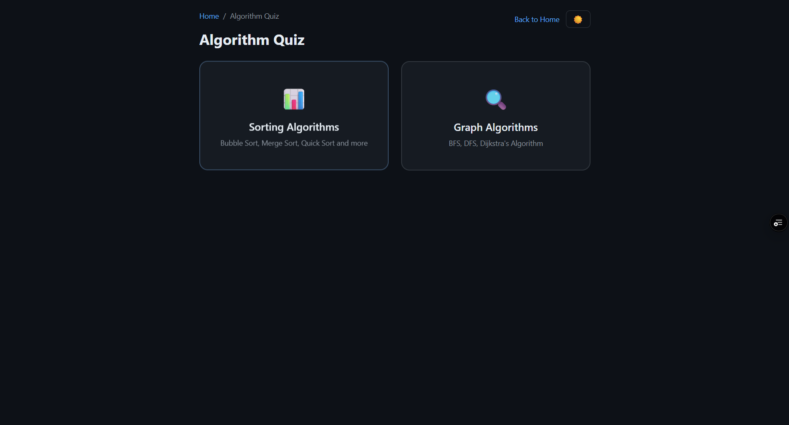

# 🚀 Algorithm Visualizer & Performance Analyzer

<div align="center">


# 🎓 Algorithm Visualizer & Performance Analyzer

### *Visualize • Analyze • Compare • Learn*

An interactive educational platform designed to help students understand Data Structures and Algorithms through real-time visualization, performance analysis, and algorithm comparison.

### 🌐 Live Demo

**https://algorithm-visualizer-performance-an.vercel.app/**

⭐ If you like this project, don't forget to star the repository!

</div>

---

# 📖 About The Project

Algorithm Visualizer & Performance Analyzer is a modern educational web application developed as a **University Final Year Project**. The platform helps students understand how algorithms work internally instead of simply showing the final output.

Users can visualize each algorithm step-by-step, observe how comparisons and swaps occur, learn how time complexity is derived mathematically, compare multiple algorithms side-by-side, and evaluate their performance using real execution statistics.

The application is designed following **Shneiderman's Eight Golden Rules of Human-Computer Interaction (HCI)**, ensuring a minimal, intuitive, consistent, and user-friendly interface.

---

# ✨ Features

## 🔹 Sorting Algorithm Visualizer

Supported Algorithms

- Bubble Sort
- Selection Sort
- Insertion Sort
- Merge Sort
- Quick Sort
- Heap Sort

### Features

- Interactive visualization
- Random array generation
- Adjustable animation speed
- Step-by-step execution
- Pause / Resume animation
- Best Case Analysis
- Average Case Analysis
- Worst Case Analysis
- Pseudocode
- Algorithm explanation
- Performance analysis
- Algorithm comparison
- Complexity visualization

---

## 🌐 Graph Algorithm Visualizer

Supported Algorithms

- Breadth First Search (BFS)
- Depth First Search (DFS)
- Dijkstra's Shortest Path Algorithm

### Features

- Random graph generation
- Adjustable number of nodes
- Source and destination selection
- Interactive graph traversal
- Shortest path visualization
- Step-by-step execution
- Algorithm explanation
- Performance analysis
- Complexity analysis
- Algorithm comparison

---

## 📊 Performance Analyzer

Compare algorithms using real execution statistics.

Metrics include:

- Execution Time
- Number of Comparisons
- Number of Swaps
- Memory Usage (Estimated)
- Time Complexity
- Space Complexity

---

## 📈 Complexity Analysis

Every algorithm includes detailed explanations of:

- Best Case
- Average Case
- Worst Case

Instead of simply displaying Big-O notation, the application explains how the complexity is mathematically derived step-by-step.

---

## 🧠 Interactive Quiz

A dedicated quiz module allows students to test their understanding of algorithms.

Features include:

- Sorting Algorithm Quiz
- Graph Algorithm Quiz
- Topic Selection
- Multiple Choice Questions
- Score Calculation
- Progress Tracking
- Answer Review
- Explanation of Correct Answers

---

# 🎯 Educational Objectives

The project aims to:

- Improve algorithm understanding through visualization.
- Help students learn algorithm execution step-by-step.
- Demonstrate algorithm complexity analysis.
- Compare algorithm efficiency.
- Provide an interactive learning experience.
- Enhance practical understanding of Data Structures and Algorithms.

---

# 🖥️ User Interface

The application follows a minimal and modern educational design.

Design principles include:

- Minimal Interface
- Responsive Design
- Consistent Navigation
- Accessibility Friendly
- High Readability
- User Control
- Error Prevention
- Immediate Feedback

Designed according to **Shneiderman's Eight Golden Rules of HCI**.

---

# 🛠️ Technology Stack

## Frontend

- React
- TypeScript
- Vite
- HTML5
- CSS3
- JavaScript (ES6+)

## Visualization

- Interactive Animations
- Dynamic Graph Rendering
- Algorithm Simulation

## Charts

- Chart.js

## Development Tools

- Git
- GitHub
- Visual Studio Code

## Deployment

- Vercel

---

# 📂 Project Structure

```text
Algorithm-Visualizer/
│
├── src/
│   ├── algorithms/
│   ├── components/
│   ├── pages/
│   ├── visualizers/
│   ├── hooks/
│   ├── utils/
│   ├── assets/
│   └── styles/
│
├── public/
├── package.json
├── vite.config.js
├── README.md
└── index.html
```

---

# 🚀 Getting Started

## Clone the Repository

```bash
git clone https://github.com/JagatKC-0506/algorithm-visualizer-performance-analyzer.git
```

## Navigate to the Project

```bash
cd algorithm-visualizer-performance-analyzer
```

## Install Dependencies

```bash
npm install
```

## Run the Development Server

```bash
npm run dev
```

Open your browser and visit:

```
http://localhost:5173
```

## Build for Production

```bash
npm run build
```

---

# 🌍 Live Website

### 🚀 Vercel Deployment

https://algorithm-visualizer-performance-an.vercel.app/

---

# 📸 Screenshots

> Add screenshots before publishing.

# Home Page



# Sorting Visualizer



# Graph Visualizer



# Quiz 



# 💡 Future Improvements

- AVL Tree Visualizer
- Binary Search Tree Visualizer
- Red-Black Tree Visualizer
- Searching Algorithms
- Dynamic Programming Visualizer
- Greedy Algorithms
- Backtracking Algorithms
- Minimum Spanning Tree Algorithms
- User Authentication
- Save User Progress
- Download Visualization
- Dark / Light Theme Switching

---

# 🎓 Academic Purpose

This project was developed as a **University Final Year Project** to provide an interactive platform for learning and understanding algorithms through visualization and performance analysis.

---

# 👨‍💻 Author

## Jagat KC

University Final Year Project

GitHub: https://github.com/JagatKC-0506

---

# 📄 License

This project is intended for educational and academic purposes.

Feel free to use, modify, and learn from it.

---

<div align="center">

## ⭐ Star this repository if you found it useful!

Made with ❤️ using **React**, **TypeScript**, **Vite**, and **Vercel**

</div>